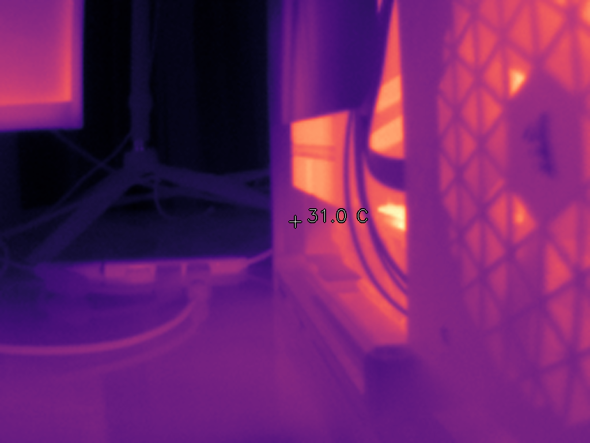

# InfiRay P2 Pro python viewer


This is a simple python example to view the termal camera module using opencv and numpy.





## python package

You can install and use it as a python package:

```sh
pip install -e .
```

run it using this command:

```sh
infiray-show
```


## single file example

In case you are looking a single file example to use the camera look for `infiray_show.py`:

```sh
python infiray_show.py
```